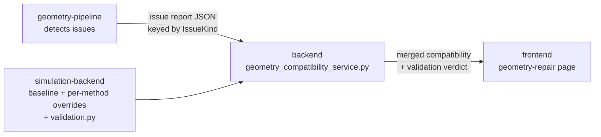

# Geometry Compatibility & Custom Validation — Integration Guide

This guide is for developers integrating a new simulation method into CHORAS.
It explains the two mechanisms that decide **whether an uploaded geometry can be
run with your method**:

1. **Baseline geometry compatibility** — a declarative JSON rule set that maps
   each geometry *issue kind* to a compatibility level, which your method
   overrides where it differs.
2. **Custom validation** (`validation.py`) — an optional Python hook
   (`run_method_validation`) that runs your own programmatic checks on the
   geometry file at request time.

Both feed the same endpoint the frontend calls to show, e.g.,
*"compatible with 3 of 3 simulation methods"* and the per-issue badges on the
geometry-repair page.

---

## How this fits into CHORAS

CHORAS is split across three repositories that cooperate here:



1. **geometry-pipeline** analyzes the uploaded model and writes an **issue
   report** — a JSON object keyed by *issue kind* (e.g. `duplicate_vertex`,
   `boundary_edge`), each mapping to a list of detected occurrences.
2. **backend** (`app/services/geometry_compatibility_service.py`) loads the
   **baseline** from this repo, merges each method's **override** on top, then
   compares the merged rules against the issue report to produce a per-method
   verdict. If a method ships a `validation.py`, its verdict is combined in.
3. **frontend** renders the verdict: overall compatibility per method, a badge
   per issue, and enables/disables the *Use Initial / Use Repaired Model*
   buttons.


> **Key rule:** the *issue kind* strings you use in your override JSON must
> exactly match the `IssueKind` values emitted by the geometry-pipeline. The
> current set is listed in the baseline (see below).

---

## 1. Baseline Geometry Compatibility

### 1.1 What the baseline file is

`example_settings/baseline_geometry_compatibility.json` is the **single source
of truth** for the default compatibility of every geometry issue. Every method
inherits it, and only overrides the entries that differ.

It has three parts:

| Field | Purpose |
|-------|---------|
| `version` | Schema version of the baseline. |
| `compatibilityLevels` | The three allowed levels and what each means. |
| `issues` | One entry per issue kind: `label`, `description`, and default `compatibility`. |

The three compatibility levels (worst-case ordering matters — see §1.5):

| Level | Meaning | Severity rank |
|-------|---------|:-------------:|
| `compatible` | The issue does not affect this method; geometry usable as-is. | 0 |
| `warning` | Tolerated but may reduce accuracy or need review. | 1 |
| `incompatible` | Breaks this method; must be repaired before running. | 2 |

The baseline currently defines these **issue kinds** (these are the exact keys
you may override):

`duplicate_vertex`, `zero_area_face`, `non_planar_face`, `t_junction`,
`intersection`, `boundary_edge`, `possible_hole`, `small_face`,
`collinear_face`, `overlapping_face`.

Every issue entry carries a `description` explaining what the defect is, so the
baseline file doubles as a reference: open
[`example_settings/baseline_geometry_compatibility.json`](example_settings/baseline_geometry_compatibility.json),
read the `description` of each kind, and use its baseline `compatibility` as the
starting point you decide whether to keep or override for your solver.

Example baseline entry — a self-intersection, which the baseline marks as
`incompatible` because it violates a valid piecewise-linear complex:

```json
"intersection": {
    "label": "Self-intersection",
    "description": "Faces intersect each other, violating a piecewise-linear-complex (PLC).",
    "compatibility": "incompatible"
}
```

### 1.2 How your method overrides the baseline

Your method ships a small override file, referenced by the
`geometryCompatibility` key in [`methods-config.json`](methods-config.json).
You only list the issue kinds whose fields differ from the baseline — everything
else is inherited unchanged.

Real example — [`de_method/geometry_compatibility.json`](de_method/geometry_compatibility.json):

```json
{
    "extends": "choras-baseline",
    "method": "DE",
    "notes": "The Diffusion Equation solver meshes an enclosed volume, so the surface must be watertight, but it is tolerant of non-planar faces because they are retriangulated during volume meshing.",
    "issues": {
        "boundary_edge": {
            "compatibility": "warning"
        },
        "possible_hole": {
            "compatibility": "incompatible"
        }
    }
}
```

| Field | Required | Purpose |
|-------|:--------:|---------|
| `extends` | convention | Always `"choras-baseline"` — documents intent (the merge always uses the baseline). |
| `method` | convention | Human-readable method identifier for traceability. |
| `notes` | optional | Surfaced by the backend and shown to the user; explain *why* your rules differ. |
| `issues` | optional | Per-kind field overrides. Any kind you omit inherits the baseline entirely. |

### 1.3 The merge rules (exactly what happens)

The backend (`_merge_method_override`) does a **per-issue-kind field merge**:

- It deep-copies the baseline `issues`.
- For every kind in your override's `issues`, it **updates only the fields you
  provide** (so overriding just `compatibility` keeps the baseline `label` and
  `description`).
- Any kind **not mentioned** in your override is inherited unchanged.
- A kind you add that is **not** in the baseline is added as-is (use this only
  if the pipeline actually emits that kind).

So the DE example above yields: all 10 baseline issues, with `boundary_edge`
downgraded to `warning` and `possible_hole` raised to `incompatible`; the other
eight keep their baseline values.

### 1.4 Steps to add compatibility rules for a new method

1. Create `your_method/geometry_compatibility.json` using the template in §1.2.
2. Set `method` and a helpful `notes` string.
3. Under `issues`, add **only** the kinds whose `compatibility` differs from the
   baseline. Use the exact kind keys from §1.1.
4. Register it in [`methods-config.json`](methods-config.json) by adding a
   `geometryCompatibility` entry pointing at the file (path relative to this
   repo root):

   ```json
   {
       "simulationType": "YourMethod",
       "label": "Your Method",
       "geometryCompatibility": "your_method/geometry_compatibility.json",
       "methodValidation": "your_method/your_interface/validation.py",
       "entryFile": "YourInterface.py",
       "settings": "your_setting.json"
   }
   ```

5. That's it — the backend discovers the method and merges automatically. No
   backend code changes are needed.

> If you omit `geometryCompatibility`, your method inherits the **full baseline
> unchanged** — every issue keeps its baseline compatibility level.

#### What if I want a *different* compatibility than the baseline?

**Do not edit `baseline_geometry_compatibility.json` to change it for your
method.** The baseline is shared by *every* method, so editing it changes the
default for all solvers at once. Instead, express the difference as an
**override** in your own `your_method/geometry_compatibility.json`:

- To make an issue **stricter or more lenient for your method**, add that issue
  kind under `issues` with the `compatibility` you want (as the DE example does
  for `boundary_edge` and `possible_hole`). This affects only your method.
- Only edit the baseline file itself when the change is a genuine
  **project-wide default** that should apply to *all* methods (for example,
  fixing a wrong description, or changing the CHORAS-wide default for a brand-new
  issue kind emitted by the pipeline). Such a change should be reviewed as a
  shared-config change, not a per-method tweak.

### 1.5 How a verdict is computed from your rules

For a given uploaded model, the backend (`_method_result`) resolves a single
`compatible` value per method:

- It looks at which issue kinds are actually **present** (non-empty list) in the
  pipeline's report.
- The method verdict is the **worst-case** (highest severity rank) among the
  present issues' compatibility levels.
- If no rule-relevant issue is present → `compatible`.
- If your method declares a kind the report has **no information** about (the
  kind isn't a key in the report at all) and nothing else is present →
  `unknown`.

---

## 2. Custom Validation (`validation.py`)

The baseline/override system is **declarative** — it only reasons about the
issue kinds the pipeline reports. **Custom validation** lets your method run
**arbitrary Python checks** against the actual geometry file (for example: face
count limits, bounding-box size, format constraints, watertightness heuristics
specific to your solver).

**Custom validation is entirely optional.** If your method does not need any
programmatic checks beyond the baseline/override rules, simply **do not create a
`validation.py`** and **omit the `methodValidation` key** from your entry in
`methods-config.json`. The backend then decides compatibility from the
baseline/override rules alone — this is exactly what Pyroomacoustics does. You
only add validation when you need logic the declarative rules cannot express.

### 2.1 The contract

Your validation module must expose a single function:

```python
def run_method_validation(input_file: str) -> dict:
    ...
```

| Aspect | Specification |
|--------|---------------|
| **Function name** | Must be exactly `run_method_validation` (the backend looks it up by name). |
| **Parameter** | `input_file: str` — an absolute filesystem path to the geometry file (e.g. an `.obj`) resolved inside the backend's uploads folder. |
| **Return value** | A `dict` with two keys: `compatible` (bool) and `reason` (str). |
| **`compatible`** | `True` if the geometry is suitable for your method, `False` otherwise. |
| **`reason`** | Human-readable explanation, surfaced to the user (shown even when compatible). |

Minimal valid example — [`dg_method/dg_interface/validation.py`](dg_method/dg_interface/validation.py):

```python
def run_method_validation(input_file: str) -> dict:
    """Validate geometry for DG method.

    Args:
        input_file: Path to the geometry file (e.g., .obj) to validate.

    Returns:
        dict with keys:
            - compatible (bool): True if geometry is suitable, False otherwise
            - reason (str): Human-readable explanation
    """
    return {
        "compatible": True,
        "reason": "Geometry is valid for DG method (default validation).",
    }
```

A richer example — counting faces and rejecting oversized meshes:

```python
import os


def run_method_validation(input_file: str) -> dict:
    if not os.path.exists(input_file):
        return {"compatible": False, "reason": f"File does not exist: {input_file}"}

    if not input_file.lower().endswith(".obj"):
        return {"compatible": False, "reason": "File must be in OBJ format."}

    face_count = 0
    with open(input_file, "r") as f:
        for line in f:
            if line.startswith("f "):
                face_count += 1

    if face_count > 6:
        return {
            "compatible": False,
            "reason": f"Geometry has {face_count} faces; this method supports max 6.",
        }

    return {
        "compatible": True,
        "reason": f"Geometry is valid ({face_count} faces detected).",
    }
```

### 2.2 How the backend loads and runs it

- The module is referenced by the `methodValidation` key in
  [`methods-config.json`](methods-config.json) (path relative to this repo root).
- The backend imports it **dynamically** with `importlib` at request time and
  calls `run_method_validation(input_file)`
  (`geometry_compatibility_service.py`).
- Validation is **best-effort and optional**:
  - If the file is missing, the function is absent, it raises, or it returns a
    malformed dict → validation is **skipped** (treated as no verdict), and only
    the baseline/override rules apply.
  - Only a dict containing a `compatible` key is accepted; `reason` defaults to
    an empty string if omitted.

> **Keep it lightweight.** The module is imported **inside the backend process**,
> not your solver container. Do **not** import heavy solver dependencies
> (e.g. `acousticDE`, `edg-acoustics`) here — the existing modules deliberately
> note they are "lightweight … no heavy deps". Stick to the standard library and
> simple file parsing.

### 2.3 How the validation verdict combines with the rules

When both a validation module and an input file are available, the backend
combines the two verdicts using **worst-case wins** logic:

- Your `compatible: True` → verdict `compatible`; `compatible: False` →
  `incompatible`.
- This is compared against the declarative verdict from §1.5, and the **more
  severe** of the two is used as the method's final `compatible` value.
- Your `reason` string is attached to the method result and shown to the user.

So validation can only ever make a method **stricter**, never more permissive —
it cannot turn a rule-based `incompatible` into `compatible`.

### 2.4 Steps to add custom validation for a new method

1. Create `your_method/your_interface/validation.py` exposing
   `run_method_validation(input_file: str) -> dict`.
2. Implement your checks using only lightweight dependencies.
3. Always return `{"compatible": bool, "reason": str}` on **every** path,
   including error paths.
4. Register it via the `methodValidation` key in
   [`methods-config.json`](methods-config.json) (see the snippet in §1.4).
5. Test locally by uploading a model that should pass and one that should fail,
   and confirm the frontend shows the expected verdict and your `reason`.

> Custom validation is **optional**. If your method omits `methodValidation`
> (as Pyroomacoustics does), only the baseline/override rules decide
> compatibility.

---

## Quick reference

| Concern | File you edit | Key in `methods-config.json` | Backend consumer |
|---------|---------------|------------------------------|------------------|
| Default rules for all methods | `example_settings/baseline_geometry_compatibility.json` | — | `geometry_compatibility_service.py` |
| Your method's rule overrides | `your_method/geometry_compatibility.json` | `geometryCompatibility` | `_merge_method_override` |
| Your method's custom checks | `your_method/your_interface/validation.py` | `methodValidation` | `_run_method_validation` |

| Contract | Requirement |
|----------|-------------|
| Issue kind keys | Must match the pipeline's `IssueKind` values (§1.1). |
| Compatibility level | One of `compatible`, `warning`, `incompatible`. |
| Validation function | Named `run_method_validation(input_file: str) -> dict`. |
| Validation return | `{"compatible": bool, "reason": str}` on every path. |
| Validation weight | Lightweight imports only; runs in the backend process. |
| Validation effect | Can only make a method stricter (worst-case wins). |
